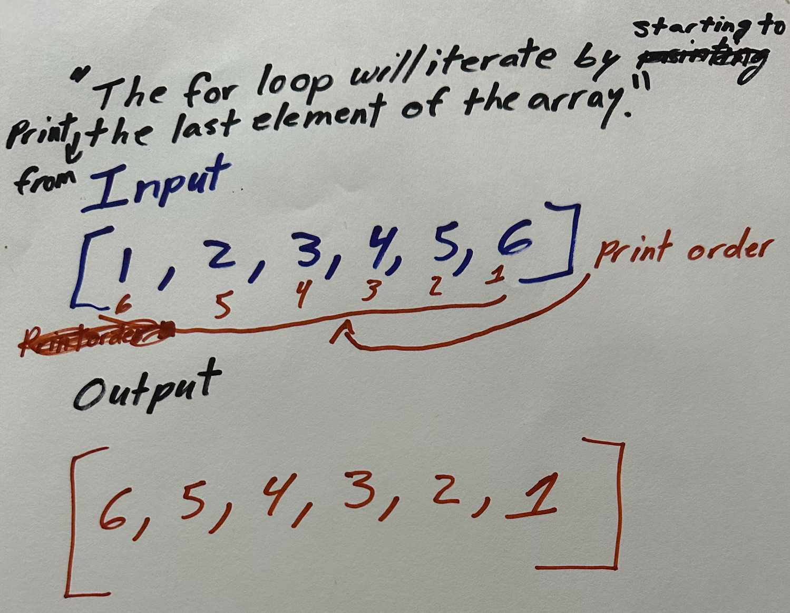

# Binary Search

## Problem Domain

My task is to write a function called BinarySearch that takes to parameters: a sorted array and the search key. Then return the index of the array’s element that is equal to the value of the search key, or -1 if the element is not in the array.  Did I summarize that correctly?

## Visualization

Does this visualization describe the problem sufficiently?

## Algorithm

- Create a method called BinarySearch with to parameters (sorted array, search key)
- Create a condition that if the element is equal to the value search key, it returns its index, else return -1.
- If the element is at the mid point return the index
- If the element is smaller than the value, then it should be on the left side
- Else it is on the right
- If no element is found, return -1

Do you have any feedback before I start coding?

## Pseudocode

- Algorithm binarySearch(int x[], int el)
- Set list of array by using the Integer class
- for the length of the array minus 1 is greater than 0, decrement by 1
- print  reverse array

## Test
