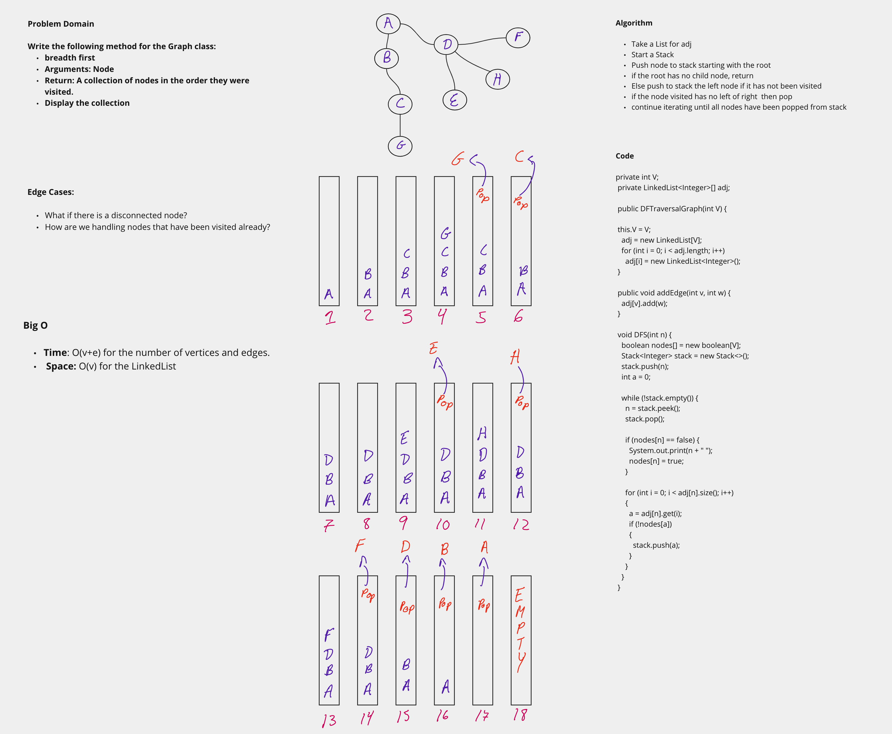

## Graph Depth First

A graph is a non-linear data structure that can be looked at as a collection of vertices (or nodes) potentially connected by line segments named edges.

## Challenge

- Write the following method for the Graph class:

  - Name: Depth first
  - Arguments: Node (Starting point of search)
  - Return: A collection of nodes in their pre-order depth-first traversal order
  - Program output: Display the collection

## Visualization

## Approach & Efficiency

- Time: O(v+e) for the number of vertices and edges.
- Space: O(v) for the LinkedList
