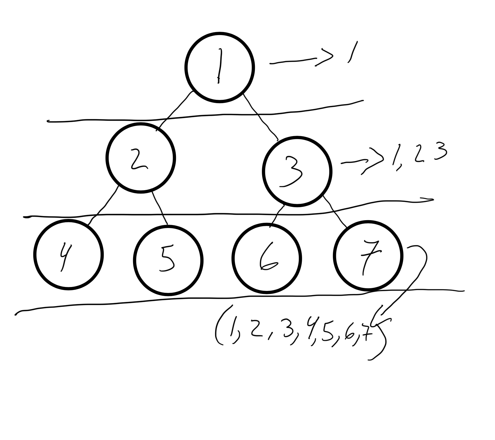

# Breadth First Add Values

### Algorithm

- If tree exists in root
- Create a new Queue
- while the node is not empty, traverse
- if the left node is not null, add that node to the left node
- if the right node is not null, add that node to the right node

### Big O

Time: O(n^2)
Space: O(n)

