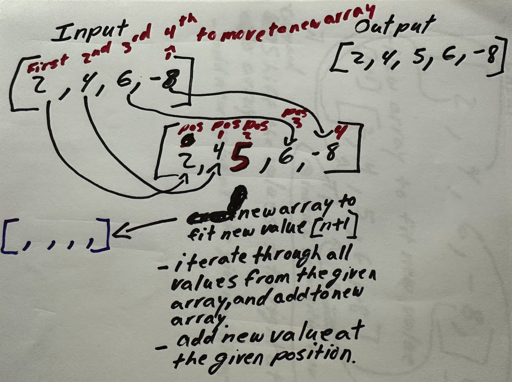

# Shift Array

## Problem Domain

My task is to write a function called insetShiftArray which takes in an array, and a value to be added, returning an array with the new value added at the middle index. Did I summarize that correctly?

## Visualization



Does this visualization describe the problem sufficiently?

## Algorithm

- Create a method called shiftArray
- Set variable for index position of new variable
- New array to fit the value that is going to be added
- Iterate and add the values of the given array in the new array
- if the index is at the set position, add the new value


Do you have any feedback before I start coding?

## Pseudocode

- Algorithm shiftArray()
- Set index of new value = 2
- new array [] = new Integer[n+1];
- for each iteration, if i is less than the length of the new array increment by one
- if the current iteration equals to the set index "2"
- add the set value "5"

## Code

``` Java

import java.util.Arrays;

public class Main {

import java.util.Arrays;

class Main {

  public static void shiftArray() {
    Integer nums[] = { 2, 4, 6, -8 };
    int n = nums.length;
    int idx = 2;

    Integer newNums[] = new Integer[n + 1];
    int j = 0;

    for (int i = 0; i < newNums.length; i++) {
      if (i == idx) {
        newNums[i] = 7;
      } else {
        newNums[i] = nums[j];
        j++;
      }
    }
    newNums[idx] = 5;
    System.out.println(Arrays.toString(newNums));
  }

  public static void main(String[] args) {
    shiftArray();
  }
}


```
