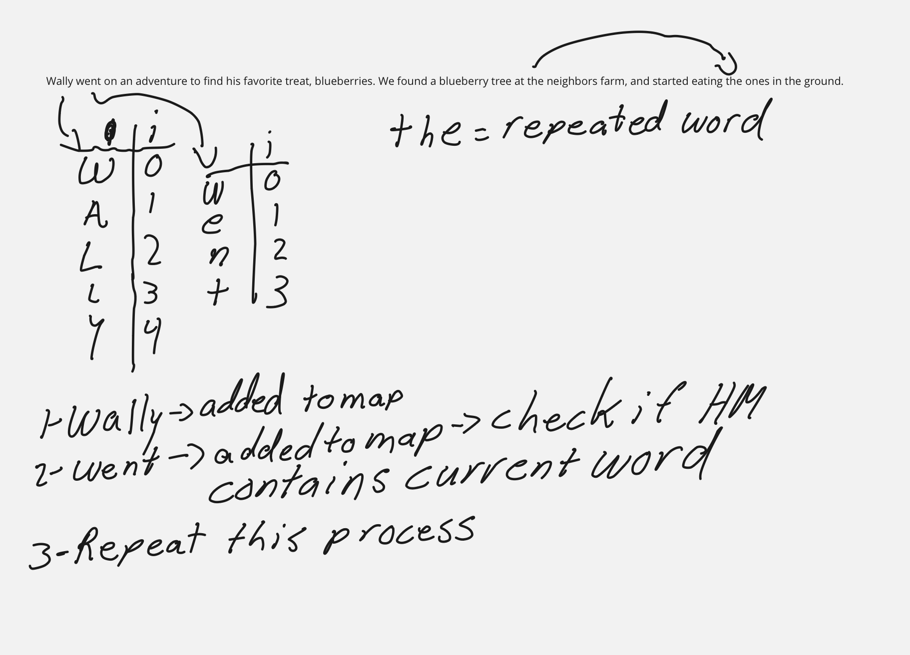

# Hashmap Repeated Word

## Problem domain

Write a function called repeated word that takes in a string argument, and finds the first word to occur more than once in a string.
- Arguments: String
- Return: string

## Visualization



## Algorithm

- Use a Hashmap that takes in Strings
- iterate through each character for the length of the word
- Once iteration is complete, add it the map
- do the same for each word
- if the hashmap contains the current word being checked, then return

Big O

Time: O(n) As we iterate through every character n times
Space O(n) If we have to add to the map every word (worst case)

## Code

```java
public String repeatedWord(String word) {
HashMap<String, Boolean> hashmap = new HashMap<>(1024);
String current = "";
for (int i = 0; i < word.length(); i++) {
char character = Character.toLowerCase(word.charAt(i));
if ((character >= 'a' && character <= 'z') || character == '\'')
current = current + character;
else if (character == ' ' || i == word.length() - 1) {
if (hashmap.contains(current))
return current;
hashmap.set(current, true);
current = "";
}
}
return "";
}
```

