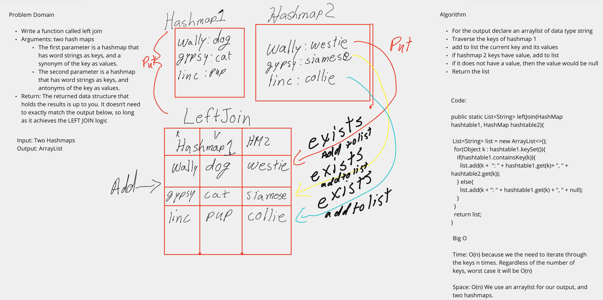

# Hashmap Repeated Word

## Problem domain

Write a function called repeated word that takes in a string argument, and finds the first word to occur more than once in a string.
- Arguments: String
- Return: string

## Visualization



## Approach and Efficiency

For this task the best approach and efficient way was to use an Arraylist for the output. For Big O, time and space complexity were both O(n).

## Algorithm

- For the output declare an arraylist of data type string
- Traverse the keys of hashmap 1
- add to list the current key and its values
- if hashmap 2 keys have value, add to list
- if it does not have a value, then the value would be null
- Return the list

## Code

```java

  public static List<String> leftJoin(HashMap hashtable1, HashMap hashtable2){

    List<String> list = new ArrayList<>();
    for(Object k : hashtable1.keySet()){
      if(hashtable1.containsKey(k)){
        list.add(k +  ": " + hashtable1.get(k)+ ", " + hashtable2.get(k));
      } else{
        list.add(k + ": " + hashtable1.get(k) + ", " + null);
      }
    }
    return list;
  }

```
