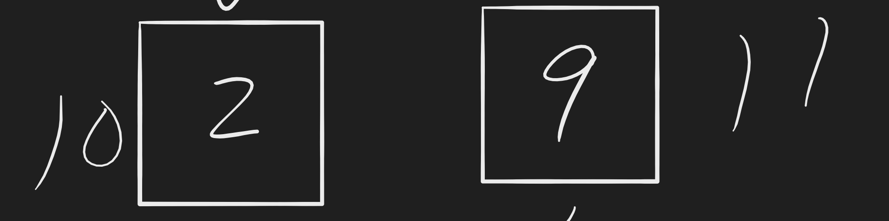

# Merge Sort Blog

## Pseudocode

```pseudocode

ALGORITHM Merge(left, right, arr, mid)
    DECLARE i
    DECLARE j
    DECLARE k

    while i < left.length && j < right.length
        if left[i] <= right[j]
            arr[k] <-- left[i]
            i <-- i + 1
        else
            arr[k] <-- right[j]
            j <-- j + 1

        k <-- k + 1

    if i = left.length
       set remaining entries in arr to remaining values in right
    else
       set remaining entries in arr to remaining values in left

```

## Full visualization


## Trace

### Sample array

***[5, 6, 3, 2, 9]***

### Pass 1


Check if left index is less than the right index, if it is, calculate its mid-point.

### Pass 2


Since merge sort uses divide and conquer, it will divide the array in equal halves. In our case left with the size of three, and right with the size of two. If needed, find the mid-point again.

### Pass 3


Continue to divide the arrays in halves.

### Pass 4


It will process the left half first, staring with 5, and 6.

### Pass 5


Now it will merge that left side by sorting them. So it will remain 5, and 6.

### Pass 6


Now we will process the right side of our first left halve which is only 7.

### Pass 7


Merge both left and right side of the first left half of the array, and sort them. This will be 3, 5, 6.

### Pass 8


Now we will process the right side of the array given.

### Pass 9


We will do the same process as we did with the left side with 2, and 9, divide in equal halves.

### Pass 10


Merge both left and right side of the first left half of the array, and sort them. This will be 2, and 9.

### Pass 11


Lastly, we will merge and sort the left an right side of the array given. The expected output should be ***[2, 3, 5, 6, 9]***.

## Big O

- Time ***O(n log(n))*** Since merge sort uses divide and conquer, it always divides in halves its array
- Space ***O(n)***

## Code

```java

public class Merge {

  int[] sortedArray;

  public int[] merge(int[] arr, int left, int mid, int right) {

    int subArrL = mid - left + 1;
    int subArrR = right - mid;

    int Left[] = new int[subArrL];
    int Right[] = new int[subArrR];

    for (int i = 0; i < subArrL; ++i)
      Left[i] = arr[left + i];
    for (int j = 0; j < subArrR; ++j)
      Right[j] = arr[mid + 1 + j];

    int i = 0, j = 0;

    int k = left;
    while (i < subArrL && j < subArrR) {
      if (Left[i] <= Right[j]) {
        arr[k] = Left[i];
        i++;
      }
      else {
        arr[k] = Right[j];
        j++;
      }
      k++;
    }

    while (i < subArrL) {
      arr[k] = Left[i];
      i++;
      k++;
    }

    while (j < subArrR) {
      arr[k] = Right[j];
      j++;
      k++;
    }
    return arr;
  }

  public int[] sort(int arr[], int left, int right)
  {
    if (left < right) {
      int mid = left + (right - left) / 2;

      sort(arr, left, mid);
      sort(arr, mid + 1, right);

      merge(arr, left, mid, right);
    }
    return arr;
  }

}

```

## Test

```java

  @Test
  void testMergeSort() {
    Merge sut = new Merge();
    int[] arr = {5, 6, 3, 2, 9};
    int[] target = {2, 3, 5, 6, 9};
    sut.sort(arr, 0, arr.length - 1);
    assertArrayEquals(arr, target);
  }

```

## Link to Code

- [link to code](https://github.com/MaximoVincente/data-structures-and-algorithms/blob/main/java/datastructures/lib/src/main/java/datastructures/sorts/Merge.java)
