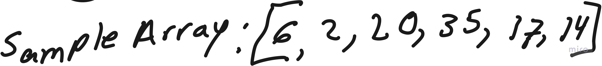

# Selection Sort

## Pseudocode

```pseudocode

SelectionSort(int[] arr)
    DECLARE n <-- arr.Length;
    FOR i = 0; i to n - 1
        DECLARE min <-- i;
        FOR j = i + 1 to n
            if (arr[j] < arr[min])
                min <-- j;

        DECLARE temp <-- arr[min];
        arr[min] <-- arr[i];
        arr[i] <-- temp;

```

## Trace

- Sample Array


### Pass 1
Visualization:


### Pass 2

- Visualization


### Pass 3

- Visualization


### Pass 4

- Visualization


### Pass 5

- Visualization


### Pass 6

- Visualization


