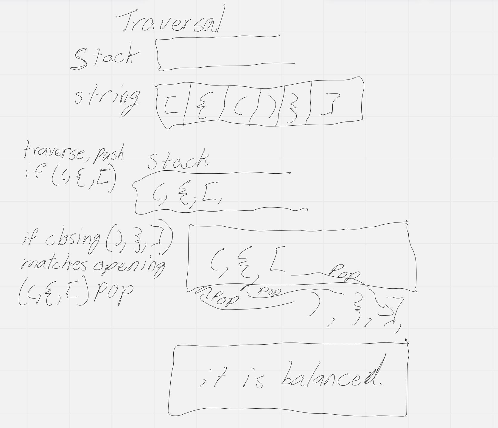

# Stack Queue Brackets

## Problem Domain

My task is to write a function called validate brackets that takes in an argument of string, and returns a boolean representing whether or not the brackets in the string are balanced

## Visualization

## Algorithm

- Declare Stack
- Traverse
- if char is "(", "{", "[" , push to stack
- if char is ")", "}", "]" , pop the matching opening bracket from stack
- After traversal if there are no brackets in the stack, then it is balanced(true)
- if there are brackets left in the stack then it is not balanced (false)

## Big O

- Time: O(n) "Traversal of argument string"
- Space: O(n)
