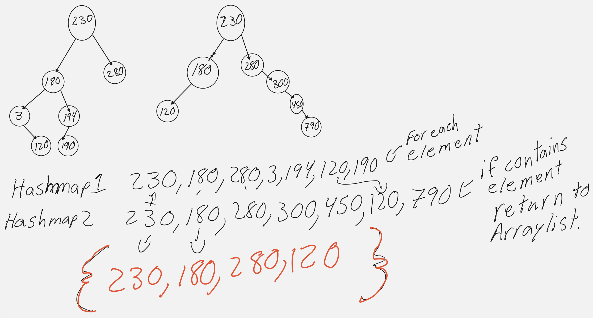

# Hashmap Tree Intersection

## Problem domain

- Find common values in 2 binary trees.
- Write a function called tree_intersection that takes two binary trees as parameters.
- Using your Hashmap implementation as a part of your algorithm, return a set of values found in both trees.

## Input/Output
- Input: Binary Tree 1, and Binary Tree 2
- Output
- Arraylist of common values

## Visualization



## Algorithm

- Use Hashmap to hold the integer values of the two binary trees.
- Use an arraylist to store the output values.
- Traverse both trees checking for true value.
- If true the return to the Arraylist.
- Return common values.

## Big O

- Time: O(n) Because of the iterations n times in the for each loop.
- Space: O(n) We use an Array list to store the output, and the space used when iterating the trees.

## Code

``` java
  public ArrayList<Integer> treeIntersection(BinaryTree tree1, BinaryTree tree2) {
    HashMap<Integer, Boolean> hashmap1 = new HashMap<>(1024);
    HashMap<Integer, Boolean> hashmap2 = new HashMap<>(1024);
    ArrayList<Integer> list = new ArrayList<>();
    addToHashMap(tree1.root, hashmap1);
    addToHashMap(tree2.root, hashmap2);
    for (Integer element : hashmap1.keys()) {
      if (hashmap2.contains(element))
        list.add(element);
    }
    return list;
  }

  private void addToHashMap(Node root, HashMap<Integer, Boolean> hashmap) {
    if (root == null)
      return;
    hashmap.set(root.value, true);
    addToHashMap(root.left, hashmap);
    addToHashMap(root.right, hashmap);
  }
  ```
